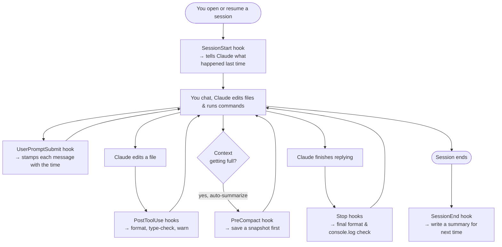
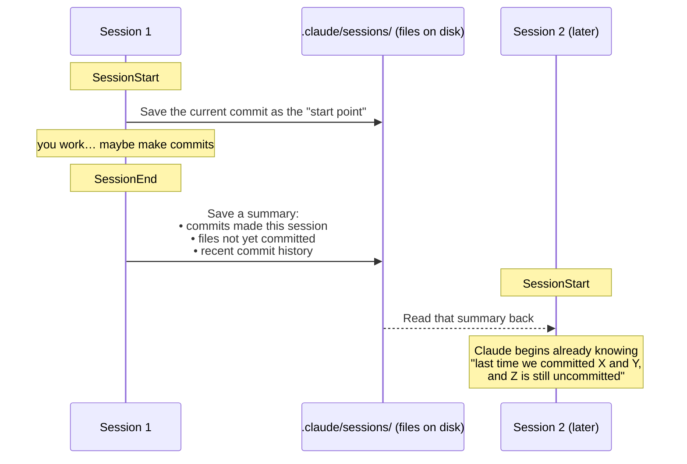
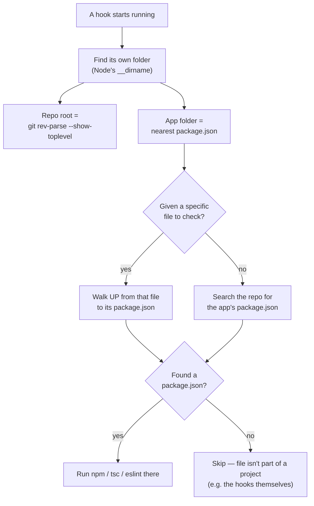
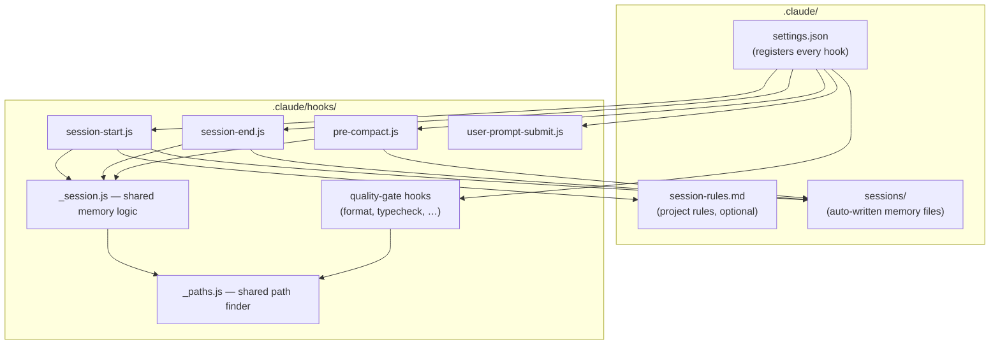

# Claude Code hooks — session memory & quality gates

This folder holds small Node scripts that Claude Code runs automatically at
certain moments (called **hooks**). They do two jobs:

1. **Session memory** — help each new Claude session remember what the last one did.
2. **Quality gates** — auto-format, type-check, and warn about problems as you work.

Nothing here is tied to this specific computer or folder. Drop the whole
`.claude/` folder into another repository and it just works (see
[Portability](#how-it-stays-portable) below).

---

## When does each hook run?

Claude Code fires hooks at fixed moments in a session. Here are the ones this
system uses:

---

## Session memory: how one session talks to the next

The goal: when you start a new session, Claude already knows what the previous
one accomplished — **based on real git history**, not guesswork.

**Why this is better than before:** the old version listed "modified files"
using `git diff`. The moment you committed your work, that list went *empty* —
so the next session saw nothing. The new version records **commits**, which
survive committing. (Old-format files are still read correctly if found.)

---

## Timestamps

Claude has no built-in clock. The **UserPromptSubmit** hook quietly adds the
current time (e.g. `[14:32 UTC]`) to each of your messages. This gives Claude a
sense of how much time passes between steps — handy in long sessions for
understanding when each decision happened.

---

## Quality gates (the safety net)

These run while you work and protect code quality. They only ever *warn* or
*auto-fix* — except the commit secret-scan, which can block a bad commit.

| When | Hook | What it does |
|---|---|---|
| After an edit | `post-edit-format` | Auto-formats the file with Prettier |
| After an edit | `post-edit-typecheck` | Runs `tsc` and flags type errors in that file |
| After an edit | `post-edit-console-warn` | Warns about leftover `console.log` |
| After an edit | `post-edit-design-quality-check` | Warns about generic UI patterns (Simvest design rules) |
| Before a commit | `pre-bash-commit-quality` | **Blocks** secrets/`debugger`; warns on lint & commit-message style |
| Before bash | `pre-bash-block-no-verify` | Stops `--no-verify` from skipping checks |
| When Claude finishes | `stop-quality-gate` | Batch format + type-check of changed files |
| When Claude finishes | `stop-check-console-log` | Final scan for `console.log` in app source |

---

## How it stays portable

The hooks never hardcode a path like `/workspaces/simvest`. Instead they figure
out where they are at runtime. Two shared helper files do this:

- **`_paths.js`** — works out the important folders.
- **`_session.js`** — the shared session-memory logic.

- **Repo root** is where `git` commands run (so paths come out clean).
- **App folder** is where `npm`, `tsc`, and `eslint` run (the folder with
  `package.json`). In Simvest that's the `simvest/` subfolder; in a repo where
  the app sits at the top level, it's the top level — detected automatically.
- **Need to override it?** Create `.claude/hooks.config.json` with
  `{ "appDir": "path/to/app" }`.
- **Project-specific rules** shown at session start live in
  `.claude/session-rules.md`. Delete or replace that file in another repo — if
  it's missing, the hooks simply skip the rules section.

The only path that *is* configured is in `settings.json`, which points to each
hook using `$CLAUDE_PROJECT_DIR` (a variable Claude Code fills in with the
project root) — again, no fixed location.

---

## Files in this system

**Note:** files starting with `_` (`_paths.js`, `_session.js`) are *shared
helpers*, not hooks — they're never run on their own, only imported by the real
hooks.
